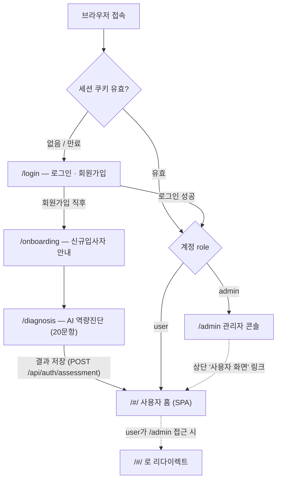
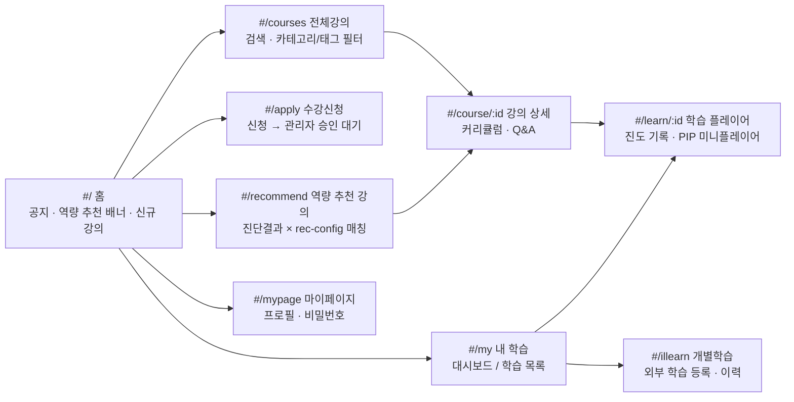
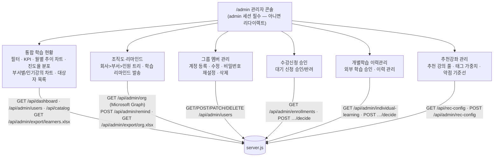
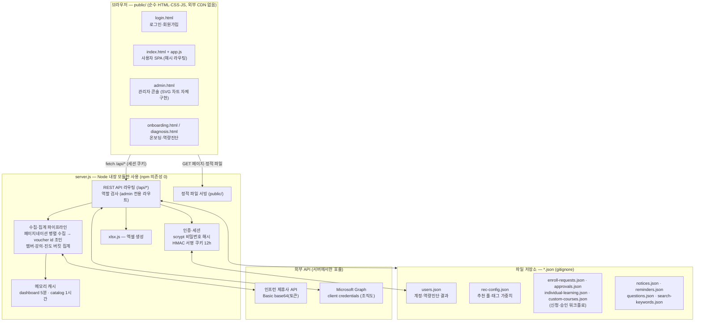
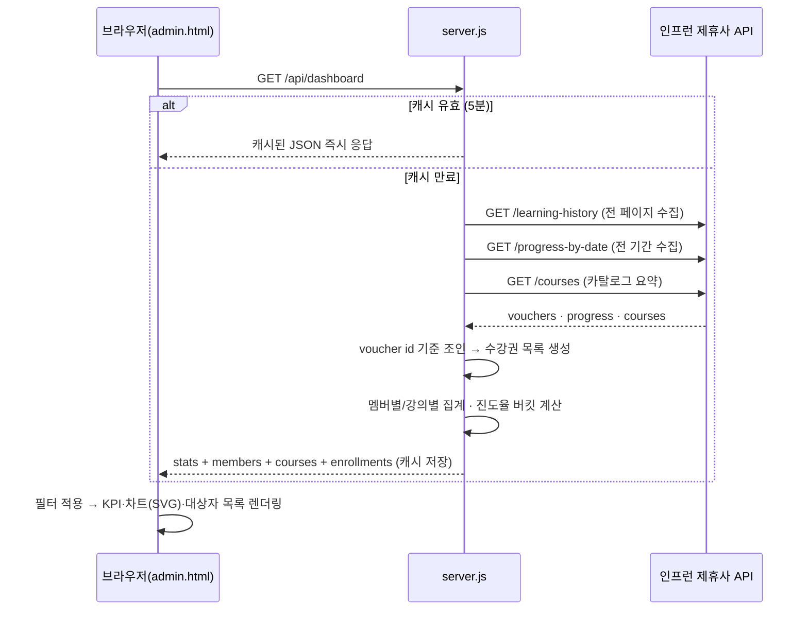

# LMS — 인프런 비즈니스 학습 대시보드

인프런 비즈니스 **제휴사 API**로 그룹(임직원)의 학습 데이터를 가져와 웹 대시보드로 시각화하는 프로젝트입니다.

## 구조

- **`server.js`** — 의존성 없는 Node 서버(내장 모듈만 사용). 토큰을 `.env`에서 읽어 서버 측에서만 인프런 API를 호출합니다(토큰이 브라우저에 노출되지 않음). 인증/세션, REST API, 정적 파일 서빙, 캐시, 엑셀 내보내기를 모두 담당합니다.
- **`public/index.html` + `public/app.js`** — 사용자 화면 SPA(해시 라우팅, 순수 HTML/CSS/JS, 외부 CDN 없음).
- **`public/admin.html`** — 관리자 콘솔(단일 파일, SVG 차트 자체 구현).
- **`public/login.html` / `onboarding.html` / `diagnosis.html`** — 로그인·온보딩·역량진단 단독 페이지.
- **`xlsx.js`** — 의존성 없는 엑셀(xlsx) 생성 모듈 (관리자 내보내기용).
- **`*.json`** — 파일 기반 저장소(계정·신청·설정 등, `.gitignore`로 커밋 제외).
- **`.env`** — API 액세스 토큰 (⚠️ `.gitignore`로 커밋 제외).

## 실행

```bash
npm start          # = node server.js
```

실행 후 브라우저에서 **http://localhost:3000** 접속.

## 화면 구조 (사용자 / 관리자 분리)

| URL | 화면 | 접근 |
| --- | --- | --- |
| `/login` | 로그인 · 회원가입 (사용자/관리자 계정 생성) | 전체 |
| `/#/…` | 공통·사용자 화면 (강의정보 · 수강신청 · 내 학습 · 마이페이지 · 검색) | 로그인 필요 |
| `/onboarding` | 신규입사자 온보딩 뷰 → 역량진단으로 연결 | 회원가입 직후 |
| `/diagnosis` | AI 역량진단 (20문항) — 결과가 계정에 저장되어 맞춤 추천에 사용 | 로그인 필요 |
| `/admin` | 관리자 콘솔 (통합 학습 현황 · 조직도·리마인드 · 그룹 멤버 관리 · 수강신청 승인 · 개별학습 이력관리 · 추천강좌 관리) | **관리자 전용** |

- 계정은 `users.json`(gitignore)에 저장, 세션은 HMAC 서명 쿠키(12시간).
- 역량진단 결과(E/V/O/F 약점·레벨)에 따라 **검색서비스 상단 배너**에 맞춤 추천 강좌가 노출되고, 검색 결과에도 태그 가중치가 반영됩니다. 추천 강의 풀·태그 가중치는 관리자 콘솔의 **추천강좌 관리**에서 수정합니다(`rec-config.json`).
- ⚠️ 데모 편의상 로그인 페이지에서 관리자 계정도 자유롭게 생성됩니다. 실사용 전 관리자 가입 제한(가입코드 등)을 추가하세요.

> 포트를 바꾸려면 `.env`의 `PORT` 값을 수정하세요.

## 화면 흐름도

### 1) 공통 흐름 (진입·인증·역할 분기)

모든 진입은 세션 확인 → 로그인 → 역할(role) 분기로 흐릅니다. 신규 회원가입 시에만 온보딩 → 역량진단을 거쳐 홈으로 들어갑니다.



- 세션: HMAC 서명 쿠키(`lms_sess`, 12시간). 만료·위조 시 401 → `/login`으로 이동.
- 관리자는 사용자 화면도 볼 수 있지만 개인 메뉴(내 학습·개별학습·마이페이지)는 숨김/차단됩니다.
- 역량진단 결과는 계정(`users.json`)에 저장되어 홈 배너·역량 추천 강의에 사용됩니다.

### 2) 사용자 화면 흐름 (`/#/…` SPA)

`index.html + app.js`가 해시 라우팅으로 화면을 전환합니다. 시작 시 카탈로그·내 학습·추천설정·공지 등을 병렬 로드한 뒤 라우팅합니다.



- **수강신청 플로우**: `#/apply`에서 강의 검색·신청 → `enroll-requests.json`에 대기 상태로 저장 → 관리자가 콘솔에서 승인/반려 → 사용자 홈·내 학습에 상태 반영.
- **개별학습 플로우**: `#/illearn`에서 외부 학습(도서·세미나 등) 등록 → 관리자 승인 후 이력으로 인정.
- **추천 플로우**: 역량진단 약점 → `rec-config.json`의 강의 풀·태그 가중치와 매칭 → 홈 배너 + `#/recommend`에 노출.

### 3) 관리자 화면 흐름 (`/admin` 콘솔)

사이드바 탭 단위 SPA입니다. 각 탭이 사용하는 서버 API와 함께 표시합니다.



## 소프트웨어 아키텍처

3계층 구조입니다: **브라우저(정적 프론트) → Node 서버(단일 파일, 의존성 0) → 외부 API + 파일 저장소**. 인프런 토큰과 Graph 자격증명은 서버에만 존재하고, 브라우저는 항상 `/api/*`만 호출합니다.



### 핵심 데이터 흐름 — `/api/dashboard` (관리자 통합 학습 현황의 원천)



### 설계 포인트

- **의존성 0**: 서버는 `node:http`·`node:crypto`·`node:fs`만 사용, 프론트는 프레임워크·CDN 없이 순수 JS. `npm install` 없이 `node server.js`로 바로 실행됩니다.
- **비밀 격리**: 인프런 토큰·Graph 자격증명은 `.env` → 서버 메모리에만 존재. 브라우저에는 절대 전달되지 않습니다.
- **캐시 전략**: 인프런 API는 페이지네이션 수집 비용이 크므로 dashboard 5분 / catalog 1시간 메모리 캐시(+ `?refresh=1` 강제 갱신, 동시 요청은 빌드 중인 Promise 공유).
- **파일 저장소**: DB 없이 JSON 파일로 상태 저장(계정·신청·설정). 데모/사내 소규모 운영 전제이며, 규모가 커지면 DB 교체 지점입니다.
- **역할 기반 접근**: 모든 `/api/admin/*` 라우트는 서버에서 세션의 role을 재검사합니다(프론트 숨김은 UX일 뿐, 권한은 서버가 강제).

## 인프런 제휴사 API 사양

- Base URL: `https://partners.inflearn.com/api/v1`
- 인증: `Authorization: Basic base64({토큰})`
- 사용 엔드포인트:
  | 엔드포인트 | 메서드 | 설명 |
  | --- | --- | --- |
  | `/courses` | GET | 강의 조회 |
  | `/signup` | POST | 그룹 멤버 등록 |
  | `/check-enrollment` | GET | 수강 신청 가능여부 조회 |
  | `/enrollment` | POST | 수강 신청 |
  | `/learning-history` | GET | 학습 현황 조회 |
  | `/learning-status-by-units` | GET | 수업별 학습 현황 조회 |
  | `/progress-by-date` | GET | 일별 진도율 조회 |

문서: https://inflab-1.gitbook.io/partners-api

## 서버 API (로컬)

| 그룹 | 주요 라우트 | 설명 |
| --- | --- | --- |
| 상태 | `GET /api/health` | 인프런 토큰 유효성 확인 |
| 데이터 | `GET /api/dashboard` · `/api/catalog` · `/api/course?id=` · `/api/my?uuid=` | 집계 대시보드(5분 캐시) · 전체 강의 카탈로그(1시간 캐시) · 강의 상세 · 내 학습 (`?refresh=1` 강제 갱신) |
| 인증 | `POST /api/auth/signup·login·logout` · `GET /api/auth/me` · `POST /api/auth/profile·change-password·assessment` | 계정·세션·프로필·역량진단 결과 저장 |
| 워크플로 | `GET/POST/DELETE /api/enrollments` · `/api/individual-learning` · `/api/custom-courses` · `/api/approvals` · `/api/questions`·`/api/answers` | 수강신청·개별학습·커스텀 강의·승인·Q&A |
| 관리자 | `/api/admin/users` · `/api/admin/org` · `/api/admin/remind(ers)` · `/api/admin/enrollments(+/decide)` · `/api/admin/individual-learning(+/decide)` · `/api/admin/rec-config` · `/api/admin/notices` · `/api/admin/search-keywords` · `/api/admin/export/learners.xlsx`·`org.xlsx` | 멤버 관리 · 조직도 · 리마인드 · 승인 처리 · 추천/공지/검색어 설정 · 엑셀 내보내기 (**role=admin 필수**) |
| 프록시 | `GET /api/courses`, `/api/learning-history`, `/api/progress-by-date`, `/api/check-enrollment`, `/api/learning-status-by-units` | 인프런 원본 API 프록시(쿼리 그대로 전달) |

## ⚠️ 보안 / 개인정보

- **API 토큰**은 실제 사내 학습 데이터 접근 자격증명입니다. `.env`에만 두고 절대 커밋/공유하지 마세요.
- 응답 데이터에는 **임직원 이메일 등 개인정보(PII)**가 포함됩니다. 데이터 스냅샷을 파일로 저장하거나 공개 저장소에 올리지 마세요.
